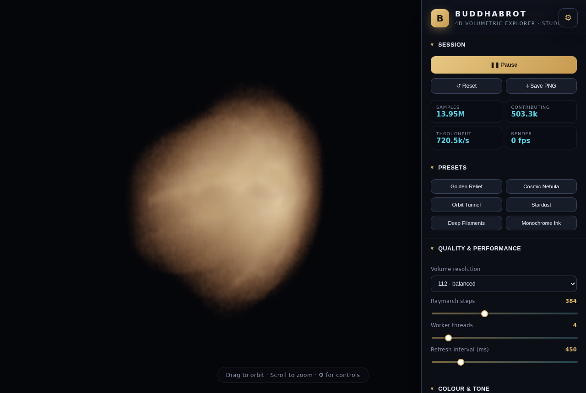

# Buddhabrot · 4D Volumetric Explorer

A premium, fully interactive instrument for exploring the **Buddhabrot** as a true
three-dimensional projection of its underlying **four-dimensional** structure.

Orbits of the Mandelbrot iteration `z → z² + c` live in the 4D space
`(Re c, Im c, Re z, Im z)`. This explorer samples those orbits with a parallel,
progressive Monte-Carlo engine, applies an interactive **4D rotation** to the
whole space, projects it into a 3D density grid, and renders that grid with a
physically-motivated **emission + absorption volumetric raymarcher**. Rotating
the 4D space reveals cross-sections of the hyper-structure that a flat
Buddhabrot can never show.



## Highlights

- **True 4D → 3D projection.** Six independent rotation-plane angles let you turn
  the `(Re c, Im c, Re z, Im z)` space and watch hidden dimensions emerge.
- **Nebulabrot colour.** Three independent iteration-budget channels (R/G/B)
  give the orbit's escape time a physical colour — warm slow-escape cores,
  cooler fast-escape haloes.
- **Massively parallel, progressive.** A pool of Web Workers accumulates into a
  single shared density volume using lock-free atomic adds. The cloud refines
  live while you fly the camera and tune every control.
- **Volumetric raymarching** with front-to-back emission/absorption compositing,
  logarithmic density compression, per-channel exposure, saturation grading,
  four tone-mapping operators, dithering and a gamma stage — all live, with no
  recompute.
- **Engineering-grade control surface.** Dozens of fine-grained settings:
  iteration caps, minimum iteration, bailout, generalized seed `z₀`, sampling
  region, interior skipping, symmetry mirroring, volume resolution (48–256³),
  raymarch steps, worker count, refresh cadence and a full colour pipeline.
- **Curated presets** and one-click PNG export.

## Open it on any device

**Live (no install): https://raw.githack.com/4vmp5pkwz4-pixel/Buddhabrot/main/buddhabrot.html**

Opens in any modern browser — phone or computer — over HTTPS. Add it to your home
screen for a full-screen, app-like experience.

> An owned GitHub Pages URL (`https://4vmp5pkwz4-pixel.github.io/Buddhabrot/`) is
> wired up via `.github/workflows/pages.yml`; it activates automatically once Pages
> is enabled for the repo (Settings → Pages → Source: GitHub Actions).

## Two builds

This repo ships the explorer in two forms:

1. **`buddhabrot.html` — single self-contained file.** Zero dependencies, no build
   step, no special HTTP headers. Just open it — double-click the file, drop it on
   any static host, or load it on a phone. It uses raw WebGL2 and a main-thread,
   time-sliced progressive sampler, so it runs fluently on every device with a
   WebGL2 browser (desktop, mobile, `file://`). This is the portable build.
2. **The Vite + TypeScript project (`src/`)** — a multi-threaded edition that uses a
   Web Worker pool over `SharedArrayBuffer` for maximum sampling throughput. It
   requires a cross-origin-isolated context (COOP/COEP headers), which the dev and
   preview servers provide automatically.

Both share the same maths, look, controls and presets.

## Quick start

**Single file:** open `buddhabrot.html` in any modern browser. Nothing to install.

**Project (multi-threaded):**

```bash
npm install
npm run dev        # http://localhost:5173
```

Production build / preview:

```bash
npm run build
npm run preview    # http://localhost:4173
```

> **Cross-origin isolation is required.** The multi-threaded sampler uses
> `SharedArrayBuffer`, which the browser only exposes in a cross-origin-isolated
> context. The bundled dev and preview servers send the required headers
> automatically:
>
> ```
> Cross-Origin-Opener-Policy:   same-origin
> Cross-Origin-Embedder-Policy: require-corp
> ```
>
> Any static deployment must serve the files with those same two headers, or the
> app will show a clear "Unable to start" message instead of running.

Requires a browser with **WebGL2** and `SharedArrayBuffer` (all current
Chromium, Firefox and Safari builds).

## How it works

### Sampling (`src/compute/`)

Each worker runs an endless loop:

1. Pick a random `c` in the sampling rectangle (skipping the main cardioid and
   period-2 bulb, which never escape).
2. Iterate `z → z² + c` from the seed `z₀`, recording the orbit, until it
   escapes (`|z|² > bailout`) or hits the largest iteration cap.
3. If it escaped after at least `minIter` steps, splat every recorded orbit
   point into the shared density grid. The 4-vector `(Re c, Im c, Re z, Im z)`
   is rotated by the active 4D matrix and its first three components index the
   voxel. The orbit feeds each colour channel whose iteration budget covers its
   escape time (Nebulabrot layering). Optionally the real-axis-mirror orbit is
   splatted too, doubling throughput.

Accumulation is done with `Atomics.add` into a single `SharedArrayBuffer`, so an
arbitrary number of workers cooperate on one volume with no merge step.

### Rendering (`src/render/`)

The shared count grids are copied into an RGB float 3D texture (per-channel
maxima tracked for normalisation). A unit box is raymarched in a GLSL3 shader:
each step samples the volume, applies optional log compression, builds a colored
emission and an opacity, and composites front-to-back so dense regions occlude
what lies behind them — producing genuine depth instead of a flat x-ray sum.
Normalisation, exposure, colour balance, saturation, tone mapping and gamma all
happen in the shader, so the entire look is tunable instantly.

### Architecture

```
src/
  state.ts              configuration model, defaults, presets
  main.ts               app orchestration + progressive update loop
  compute/
    rotation.ts         4D rotation-matrix construction
    worker.ts           Monte-Carlo orbit sampler (atomic accumulation)
    pool.ts             worker pool + shared volume lifecycle
  render/
    volumeMaterial.ts   GLSL emission/absorption raymarcher
    renderer.ts         three.js scene, camera, texture upload
  ui/
    panel.ts            declarative luxury control panel
  styles.css
```

## Controls

| Group | What it does |
|-------|--------------|
| **Quality & Performance** | Volume resolution (48–256³), raymarch step count, worker threads, refresh interval. |
| **Colour & Tone** | Master/per-channel exposure, density, opacity falloff, log compression, gamma, saturation, tone-mapping operator, dither, background, bounding box. |
| **Fractal & Sampling** | R/G/B iteration caps, minimum iterations, bailout, generalized seed `z₀`, interior skip, symmetry mirror, `c`-plane sampling region. |
| **4D Projection** | Six rotation-plane angles, volume span, recentering, and continuous plane animation. |
| **Camera** | Auto-orbit, orbit speed, field of view, reset. |

Drag to orbit · scroll to zoom · the ⚙ button hides the panel for a clean view.

## Licence

MIT.
